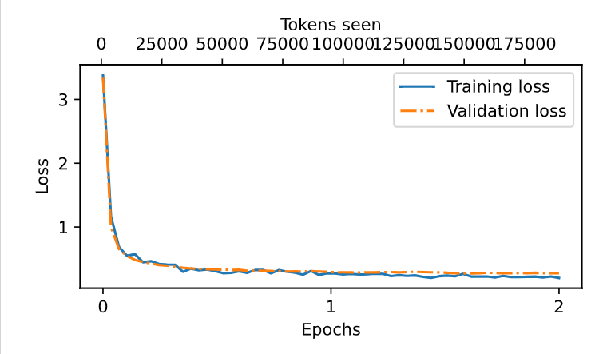
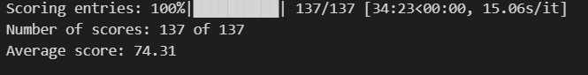

Vous aveez faim et vous souhaiter vous faire unb repas, mais vous ne savez pas quoi faire ? 
Notre LLM est là pour vous aider il peut réaliser les tâches suivantes :
- Donne les ingrédients pour la préapration d'une recette précise 
- permet de connaître les temperatures et modes de cuisson du repas 
- Effectue les conversions de kg <-> g et L <-> mL <-> cL

Le travil sera découpé en 3 parties principales 


# I – Data Engineering

Dans le cadre de l’entraînement de notre modèle de langage (LLM), la qualité et la structuration des données jouent un rôle central. Les jeux de données utilisés ont été conçus pour couvrir les fonctionnalités essentielles d’un assistant culinaire intelligent.

Trois types de données sont nécessaires à l’entraînement du modèle :

- des données listant les **ingrédients nécessaires à la réalisation de recettes**,  
- des données de **conversion d’unités**, générées de manière algorithmique,  
- des données relatives aux **temps de cuisson** (préparation, cuisson, repos).

L’ensemble des données respecte le **format Alpaca**, choisi pour sa simplicité et sa compatibilité avec le fine-tuning de modèles de type GPT. Ce format se présente comme suit :

```json
Voici une instruction qui décrit une tâche. Rédige une réponse qui complète correctement la demande.

### Instruction:
Convertis 12 cl en ml.
```

Comment sont stocké les données :
```json
{
  "instruction": "Convertis 470 cl en ml.",
  "input": "",
  "output": "470 cl = 4700 ml"
}
```

Afin d’entraîner efficacement le modèle de langage sur des tâches de conversion d’unités, deux jeux de données distincts ont été construits, chacun répondant à un objectif précis.


## I-1 - Dataset « Masse » : conversion kilogrammes ↔ grammes
Le premier jeu de données est dédié aux conversions de masse entre kilogrammes et grammes, dans les deux sens :
- kilogrammes vers grammes (kg → g),
- grammes vers kilogrammes (g → kg).

La stratégie adoptée repose sur une approche simple et systématique. Les exemples couvrent un large éventail de valeurs, incluant :
- des nombres entiers,
- des valeurs décimales simples (par exemple 0,5 kg, 1,25 kg),
- des valeurs décimales plus fines (par exemple 0,075 kg).

Cette diversité permet au modèle d’être exposé à des cas variés, allant de conversions triviales à des conversions plus complexes. L’objectif n’est pas que le modèle effectue un calcul mathématique explicite, mais qu’il apprenne des associations fiables entre les formes textuelles et les résultats attendus.

Les conversions inverses (g → kg) sont systématiquement ajoutées afin de renforcer la compréhension bidirectionnelle et d’éviter un apprentissage biaisé vers un seul sens de conversion.


## I-2 - Dataset « Volume » : conversion litres ↔ millilitres ↔ centilitres
Le second jeu de données concerne les conversions de volume. Il couvre l’ensemble des relations suivantes :
- litres vers millilitres (L → mL),
- millilitres vers litres (mL → L),
- litres vers centilitres (L → cL),
- centilitres vers litres (cL → L),
- millilitres vers centilitres (mL → cL),
- centilitres vers millilitres (cL → mL).

La logique de construction est similaire à celle du dataset de masse. Les valeurs utilisées sont choisies de manière à représenter :
- des cas standards (1 L, 0,5 L, 100 mL),
- des valeurs intermédiaires (0,75 L, 33 cL),
- des valeurs décimales plus fines (0,12 L, 15 mL).

Les conversions inverses sont, là encore, systématiquement incluses afin d’assurer une cohérence globale et de permettre au modèle de généraliser correctement dans tous les sens.


## I-3 - Justification de l’approche
La séparation des jeux de données par type de grandeur (masse et volume) permet de limiter les ambiguïtés et d’améliorer la stabilité de l’apprentissage.

Chaque dataset suit un format strict et homogène, facilitant l’apprentissage des correspondances texte → réponse.

L’utilisation de valeurs aléatoires dans des intervalles contrôlés (petites et grandes valeurs, entiers et décimaux) permet au modèle de couvrir la majorité des cas d’usage attendus, tout en réduisant le risque d’hallucinations lors de l’inférence.

Enfin, cette stratégie vise à rendre le modèle robuste face à des instructions variées, sans dépendre d’un raisonnement mathématique explicite, mais en s’appuyant sur des patterns appris de manière cohérente et répétée.


## I-4 - Dataset ingrédients nécessaires à la réalisation de recettes
La stratégie initiale de constitution du dataset des recettes reposait sur une forte diversité en termes de nombre de recettes. L’objectif était d’inclure un grand volume de recettes issues de différentes cuisines (notamment françaises et africaines), afin d’exposer le modèle à une grande variété de plats.

Cependant, cette approche s’est révélée peu efficace. Le modèle de langage rencontrait des difficultés à généraliser correctement et à prédire les tokens pertinents à partir des instructions fournies. En pratique, la diversité excessive des recettes introduisait trop de variations non structurées, rendant l’apprentissage des schémas récurrents plus complexe.

Face à ce constat, une stratégie plus ciblée et progressive a été adoptée. Plutôt que de maximiser le nombre total de recettes, l’accent a été mis sur la diversité **au sein d’un même type de recette**, en exploitant des variations contrôlées.

Par exemple, le cas des pizzas a été utilisé comme structure de référence :
- *Pizza au fromage* : pâte à pizza, sauce tomate, mozzarella, emmental,
- *Pizza au thon* : pâte à pizza, sauce tomate, mozzarella, thon,
- *Pizza au jambon* : pâte à pizza, sauce tomate, mozzarella, jambon.

Cette organisation permet au modèle d’identifier plus facilement les ingrédients communs (pâte à pizza, sauce tomate, mozzarella) ainsi que les éléments variables spécifiques à chaque déclinaison. Le modèle parvient ainsi à généraliser de manière plus efficace en apprenant des motifs récurrents plutôt qu’une juxtaposition de recettes hétérogènes.

Cette approche a été étendue à d’autres grandes familles de plats (pâtes, riz, plats traditionnels) ainsi qu’aux desserts et autres plats en conservant le même principe de variation autour d’une structure de base.

On a au total 3 dataests : recette_viande_poisson.json ,ingrédients_recette_plats.json, ingrédients_recette_desserts.json

En conclusion, cette stratégie centrée sur des **types de recettes cohérents et leurs variations** s’est révélée plus efficace pour l’apprentissage du modèle qu’une simple augmentation du nombre total de recettes, en améliorant à la fois la stabilité de l’entraînement et la capacité de généralisation du LLM.


## I-5 - Dataset pour le temps de cuisson des recettes
En ce qui concerne les temps de cuisson, les jeux de données ont été construits à partir de recettes aux **noms volontairement généralistes** (par exemple *pâtes*, *riz*, *pizza*, *gâteau*, *poisson*), afin de limiter la variabilité inutile et de faciliter la généralisation du modèle.

Pour chaque recette, des **temps de cuisson indicatifs** ont été associés, ainsi que le **mode de cuisson principal**, principalement le four ou la poêle. Ces informations correspondent à des pratiques culinaires courantes et visent à fournir au modèle des repères réalistes, sans entrer dans un niveau de précision excessif.

L’objectif de ce dataset n’est pas de produire des temps de cuisson parfaitement exacts, mais de permettre au modèle de fournir des **ordres de grandeur plausibles** en réponse à des questions utilisateur. Cette approche est cohérente avec la nature probabiliste d’un modèle de langage et avec l’usage attendu d’un assistant culinaire.

En utilisant des appellations simples et des durées de cuisson moyennes, le modèle apprend à associer un type de plat à un temps de cuisson et à un mode de préparation approprié, tout en conservant une capacité de généralisation suffisante pour répondre à des requêtes variées.


On mixe tous les datasets entre eux avec du shuffle pour ne pas qu'une partie spéciales des données se retrouve dans un partie du dataset, et eviter de prendre en compte les données pour les données et que ces données se retrouve dans la validation.
Ainsi, pon sépare le tout en trois set: trainig , validation et tests

```json
Training set length: 1165
Validation set length: 69
Test set length: 137
```


## I-6 - Batching dataset et creation du dataloader

### Data loaders et préparation des données
La préparation des données pour l’entraînement du modèle repose sur l’utilisation de *data loaders* organisant les exemples sous forme de batches. Chaque batch contient des couples *(input, target)* nécessaires à l’apprentissage du modèle de langage.

Les données sont regroupées en **145 batches**, chacun contenant **8 instructions**, ce qui correspond exactement au nombre total d’exemples du dataset (145 × 8).  


### Construction des batches
Les instructions textuelles n’ayant pas toutes la même longueur, chaque batch est construit en fonction de **la longueur de l’instruction la plus longue du batch**. Cette longueur définit la taille maximale du batch.

- Les instructions plus courtes sont complétées jusqu’à cette longueur maximale.
- La complétion se fait à l’aide d’un **token spécial de fin de texte** (*end-of-text token*).

Ainsi, chaque batch contient des séquences de longueur homogène, condition nécessaire pour le calcul matriciel et l’entraînement sur GPU.


### Définition des couples input / target
Pour chaque batch :
- **Input** correspond à la séquence d’instructions tokenisées.
- **Target** correspond à la même séquence, décalée d’un token vers la gauche.

Ce décalage permet au modèle d’apprendre à prédire le token suivant, conformément au principe des modèles auto-régressifs de type GPT.

Dans ce cadre :
- la complétion des *inputs* est réalisée avec le token *end-of-text*,
- la complétion des *targets* utilise un **token placeholder**, ignoré lors du calcul de la fonction de perte.


### Objectif de cette organisation
Cette stratégie permet :
- de garantir une structure cohérente des batches,
- de faciliter l’apprentissage de la prédiction de tokens,
- et d’optimiser l’entraînement du modèle tout en respectant les contraintes de longueur variable des instructions textuelles.

L’ensemble de ce processus constitue une étape clé entre la phase de *Data Engineering* et celle du *Fine-tuning* du modèle.


# II - Finetunig du modèle
Le modèle retenu pour ce projet est **GPT-Medium**, choisi comme compromis entre capacité de représentation et contraintes de calcul. Le fine-tuning a été réalisé à partir des poids pré-entraînés du modèle, afin de tirer parti des connaissances linguistiques générales déjà acquises.

Après la phase de tokenisation, les données préparées (instructions et cibles associées) sont fournies au modèle sous forme de batches, conformément au pipeline décrit dans la section précédente. Le modèle est alors entraîné de manière auto-régressive, avec pour objectif la prédiction du token suivant à chaque pas de temps.

L’apprentissage est supervisé à l’aide de la fonction de perte (*loss*), qui mesure l’écart entre les tokens prédits par le modèle et les tokens attendus dans les séquences cibles. Cette métrique constitue l’indicateur principal pour évaluer la progression de l’entraînement.

On observe ainsi l’évolution de la courbe de loss au cours des itérations, permettant d’analyser :
- la capacité du modèle à apprendre les structures présentes dans le dataset,
- la stabilité de l’entraînement,
- et la convergence progressive du modèle vers des prédictions plus cohérentes.

La section suivante s’appuie sur cette courbe de loss afin d’interpréter le comportement du modèle durant le fine-tuning.


<p align="center">
  
</p>

**Figure X – Évolution de la fonction de perte lors du fine-tuning**


# III - Evaluationn du modèle
L’évaluation du modèle a été réalisée à l’aide de **OLLAMA**, après son installation afin de permettre l’exécution locale du modèle fine-tuné. OLLAMA a été utilisé pour évaluer automatiquement la qualité des réponses générées par le modèle pour chaque instruction de l’ensemble de validation.

Cette phase d’évaluation repose sur l’analyse des outputs produits par le modèle en réponse aux différentes instructions, en tenant compte de leur pertinence, de leur cohérence et de leur conformité aux réponses attendues. L’ensemble de validation a ainsi permis de mesurer la capacité du modèle à généraliser correctement sur des données non vues lors de l’entraînement.

Sur l’ensemble du jeu de validation, le modèle obtient un **score global de 74%**, ce qui constitue un résultat **satisfaisant** compte tenu de la diversité des tâches traitées, notamment la génération d’ingrédients de recettes, les conversions d’unités et les informations liées à la cuisson. Ces résultats confirment la pertinence de l’approche de fine-tuning adoptée et la viabilité du modèle dans un cadre d’assistance culinaire.


<p align="center">
  
</p>